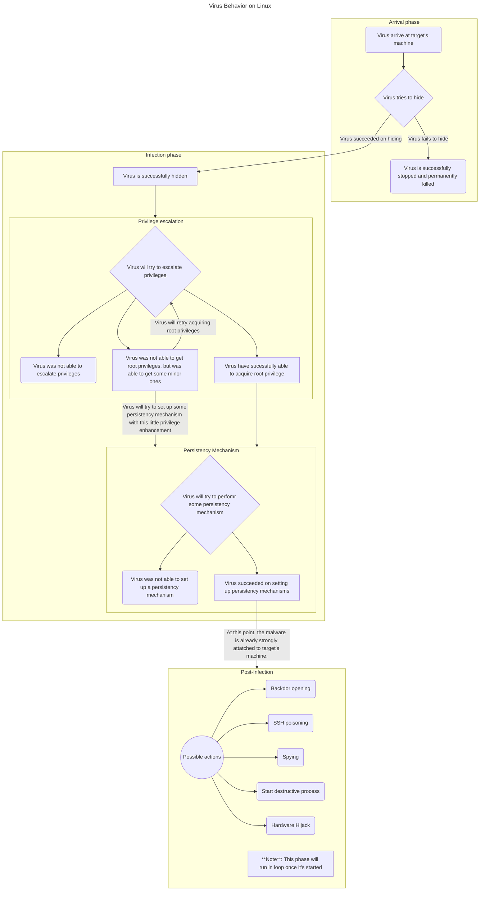
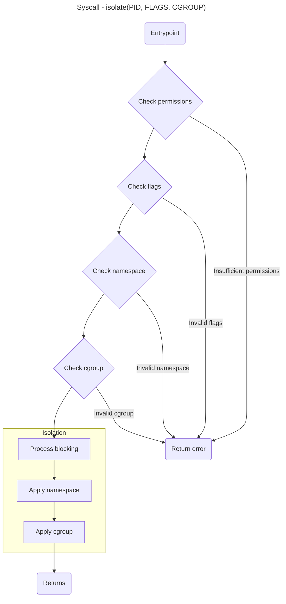

# syscall-isolate

This repository holds a new system call idea for isolating process on Linux, thinking on the specific context of malware defending, made in colaboration with:

- [@oeduardopereira](https://github.com/oeduardopereira)
- [@henriquebritoM](https://github.com/henriquebritoM)
- [@brukenzo](https://github.com/brukenzo)

---

# 1. How do Malwares Behave on Linux?

> Be aware that all of these considerations will be made thinking of **Linux** environment.

The first thing a malware will try to do when it successfully enters your machine is `hiding`, and it does this by:
1. Masquerading its name so when you use *top*/*htop* it will look like a legitimate process of your operational system - this is called **process masquerading**.
2. Abusing shared memory behavior, so that way, malwares can store data and operate using a **shared memory mapped in a file** (present in `/dev/shm`) dismissing the need of interacting with HD/SSD which would make the malware a lot more visible to anti-viruses that scans persistent memory devices. But this method still leave some traces.
3. Using the `memfd_create` syscall to run payloads in **fileless** way. It works because this syscalls create an anonymous file directly in RAM - and this file **does not** have a filepath on HD/SSD - which is not binded to any filesystem. So, the malware downloads the malicious payload, insert it into the file descriptor generated by the syscall and uses the `fexecve()` to run the payload **directly from the RAM**, <u>without ever touching persistent memory devices</u>.
4. Manipulating kernel objects to hide itself from module audit programs. It works because once the malware gain sufficiente privileges to **inject a kernel module** (LKM) it can use de **DKOM - Direct Kernel Object Manipulation** technique. This technique consists in changing directly the chained lists kernel keeps in RAM, removing itself from the chained list, so when an audit program scans all nodes in the list, the virus will not be found - and being disconnected to the chain of nodes does not stop the malware from running.

> There are more ways viruses uses to hide themselves, but these are the most relevant to our study.

So, the malware is already inside your machine and **hidden**. What are it possible actions now?

- A) Privilege escalation
    - Viruses will try to escalate privleges trying to get root access and ascend to **rootkit** sate.
- B) Persistency Mecanisms
    - Viruses will try to create ways to keep themselves always running and executing its functions.

Let's explore more deeply both of these options.

## Privilege escalation

The most common goal of all malwares is to take the **entire** control of target's machine. To do that, they must gain access to **root privileges** to complete this goal.

> When a virus gain root access, it becomes a **rootkit** and can perform some interesting and powerful operations to infect even more your machine. Once a rootkit, it's really difficult to stop it.

The ways a malware can try to escalate privileges include:
- **Kernel exploits**: The malware will try to edit its on *struct cred*, to add root privilege on its group/user ID. It's done by exploiting memory management failures inside kernel's subsystems like `io_rings`, `network management`, and some `drivers`. Once the exploit succeed, the malware is now able to overwrite its on *struct cred* to upgrade its on privileges.
- **Misconfigured SUID Binaries**: Malware scans HD/SSD looking for legitimate **SUID** binaries that were flagged this way by some **error**. Then, malware abuses this condition to run **root** commands to upgrade its own privileges or run malicious code with **root** privileges.
- **Permissive sudo**: If a system administrator have misconfigured the `/etc/sudoers` file, the malware can use this breach to run commands as *sudo*, using this to upgrade its own privileges.
- **Linux Capabilities**: Instead of giving full power to a program, using **root privileges**, Linux let you give `Capabilities`, which are some smaller privileges from **root**. If a common binary receive the `CAP_SETUID` capabilitiy accidentally, malware can abuse it to change its own identity to **root**, escalating its own privileges.

## Persistency Mechanisms

Commonly, this phase starts right after acquiring the necessary privileges, and its focus is to **make the malware an imortal process**. If the process is killed, it will start running again. If the power is cut off, the process will start at the next power on. If you try to delete de virus, it will be reinstalled. Basically, the malware need ways to **always be running** so the attacker will never miss an information/oportunity.

This way, a hacker need to breach in your machine **only one time**. The malware will be by itsown and keep itself always running through the **persistency mechanisms**. Let's learn some of them:

- **Systemd Timers**: Instead of creating a standart service that is running 24/7, a malware can create a **Sytemd Timer**. Then, the timer will be configured to wake up the virus once or twice a day. That way, it's significantly more difficult for a anti-virus to identify the malware.
- **Systemd Generators**: This may be one of the most stealth techniques. *Generetors* are scripts located in `/lib/systemd/system-generators/` and they are executed by `systemd` **before** building the dependency graphic of root servies. Once injected in a generator, a malware can be executed before other legitimate root services, being capable of changing some configuration of these services before they're setted up. This way, it's **even more difficult to a anti-virus or linux default service to identify the malware**.
- **Anonimous spool directories**: Malware can inject malicious code inside *spool directories* (rather on `/etc/crontab`), so that way it can abuse on automatic processes. Once injected its code inside a spool directory, it will hide its malicious file with some legitimate like names, and it will be ran automatically by linux.
- **Anacron abuse**: `anacron` manages processes that need to run even if the machine was shut down at the target time. Malwares can use `/etc/anacrontab` to grant that if the target machine is turned on again, the attack will be resumed the momento the system finishes setting up.
- **Shell scripts traps**: A malware can use the admin own activities to keep itself running. It does that by inject some malicious code silently in some shell configuration files like `.bashrc` or `.bash_profile`. Every time the machine administrator open a Shell, it will read and execute the malicious line at configuration files and **will help the virus**.
- **`initramfs` tampering**: The `initramfs` is a packed image file located inside `/boot/initrd.img` that contains a small linux system that will be loaded in RAM right after the bootloader (**GRUB**). This action is made to load basic drivers before the main disk (*root*) is mounted. The malware can abuse this, unpacking this image, inject its malicious code into it and packing it again. So, the next time the machine restarts, malware will start running **before the main disk is mounted**. It grants the memory control virus need to become invisible and active.
- **Remote access backdoors**: Malwares can activate `ForceCommand` in `/etc/ssh/sshd_config` file to make a malicous script run every time someone login. But even more sofisticated than that is activating `AuthorizedKeysCommand`, because malware will make the machine search for authorized keys not at the default local file but at a URL controlled by the attacker. If the attacker needs to access the target machine, SSH will make a request to the **hacker's URL**, will validate the key and will let the attacker in.

---

Okay, so now we understand how a virus can escalate privileges and keep itself running at the target's machine. But once these phases finish, what it will do?

## Post-invasion

The malware is already inside target's machine and it's already setted up with **root privileges** and **persitency mechanisms**.

Now, the malware and the attacker have some options that depend on the final goal of the attacker.

- If a hacker wants only to spy the target's machine, so the next step is to set up some backdoors that will let virus send information to the attacker.
- If the goal is to take control of the machine, the malware will try to open remote access backdoors to grant the attacker access to the target's machine.
- If the goal is to hijack the machine for cripto-mining, the malware itself is capable of hijacking the GPU, once it becomes a rootkit.
- If hacker just want to burn target's machine out, once the virus become a rootkit, it's gameover for target.

---

Okay, so we understand a little about how viruses work on *Linux*.

 Now, thinking about our new syscall proposal, let's think about the isolation process.

# 2. Isolation

A good start is to define *isolation*. We agree that an isolation process, specifically a **malware** isolation process, would work like a quarantine. The process should be put in "another reality" where it is alone an can still run if it cans. However, while in this alternative reality, we still would be able to keep track of what this process want to do or is trying to do. 

So, based on that thought the best approach to **isolating** a process for our new syscall proposal is:
- Changing process namespace to detatch it from the rest of the operational system.
- Changing process cgroup to limit the amount of hardware it will be able to use while isolated.

That way, process will be put in "a container", and will be free to do what it has to do. On the other hand, while running without any limit inside the "container", there will be a utilitary that will be monitoring the process behavior. 

Based on that logging of the process behavior, we should be able to decide if process need to be erased from the machine or if process can leave isolation.

> For studying purposes, we will focus, on this repository, on building only the **isolation** syscall. The observer utility will not be a discussion topic (at least for now).

Now, let's think about the **syscall behavior**

